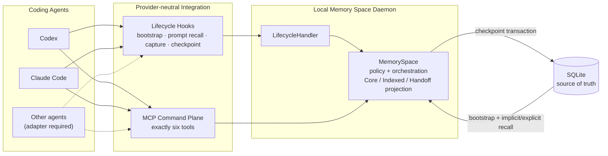

# memory-space

> 面向编码 Agent 的、与 Provider 无关的持久记忆层。
>
> A provider-neutral persistent memory layer for coding agents.

[中文](#readme-zh) · [English](#readme-en)

```text
Codex ─┐
Claude ├─ MCP + Lifecycle → MemorySpace → SQLite
Other ─┘
```

它让项目记忆跨越 Session、进程重启和 Provider，同时控制：哪些内容值得记住、哪些内容可被搜索、哪些内容进入默认上下文，以及哪些状态应交接给下一个 Agent。

It preserves durable project memory across sessions, process restarts, and providers, while controlling what gets remembered, what is searchable, what becomes default context, and what is handed off to the next agent.



> **能力说明 / Capability note:** “Provider-neutral” 指共享的 contract 与 runtime，不表示所有 Agent 都能零配置接入。Codex 与 Claude Code 都已通过真实 prompt-time recall bridge；Claude Code 模型主动调用 MCP 仍取决于网关是否保留标准工具名；其他 Agent 需要单独实现 adapter。

---

<a id="readme-zh"></a>

## 中文

> [切换到 English](#readme-en)

### 它解决什么问题

编码 Agent 通常只了解当前对话。换一个 Session、重启进程，或者从 Codex 切换到 Claude Code 后，重要的项目决策、约束、进行中的任务和阻塞信息很容易丢失。直接把完整历史对话塞回上下文，又会带来噪音、成本和安全边界不清的问题。

memory-space 把“聊天记录”与“项目记忆”分开：

- 对话只是证据，Memory 才是经过策略筛选的持久状态；
- `Core` Memory 自动进入默认上下文，但容量和类型受到控制；
- `Indexed` Memory 不进入 bootstrap；默认可在 prompt 提交时按稳定 key 自动召回，也可显式搜索；
- `Handoff Snapshot` 保存下一位 Agent 真正需要接手的工作状态；
- 所有 Memory 都归属于一个 `Space`，不会跨项目泄漏。

### 核心能力

| 能力 | 它做什么 |
| --- | --- |
| 跨 Session 持久化 | 新 Session 可以恢复同一 Space 的 Core Memory 和最新 Handoff。 |
| 跨进程恢复 | SQLite 关闭并重新打开后，Space、Session、Memory、Checkpoint 和 Handoff 仍然存在。 |
| 跨 Provider 交接 | Codex 与 Claude Code 共享同一个 MemorySpace、生命周期 contract 和同一组六个 MCP 工具；Lifecycle/Handoff 已验证，Claude 模型主动调用 MCP 仍受当前网关兼容性影响。 |
| 渐进式披露 | Core 默认可见；Indexed 不进入 bootstrap，可按项目配置进行有界 prompt-time 召回或显式搜索。 |
| 可控记忆写入 | 显式记忆默认进入 Indexed；提升到 Core 需要经过策略与容量检查。 |
| 确定性 Checkpoint | Memory 更新、Handoff 创建和事件边界推进在一个事务中提交，并支持幂等重试。 |
| 来源与变更历史 | Memory 保留来源 Session/Event、版本、状态变化和提升/降级（promotion/demotion）历史。 |
| 本地可视化检查 | 只读 Inspector 展示 Memory、历史、真实 bootstrap、最新 Handoff，以及 Stored 与 Disclosed 的差异。 |
| 本地优先 | v1 daemon 只监听 loopback，SQLite 是默认且唯一的持久权威数据源（Source of Truth）。 |

### 能力边界

**可以做：**

- 在同一项目 Space 内跨 Session、进程重启以及 Codex / Claude Code 保存和恢复项目记忆；
- 在 Session 启动时注入有界的 Core Memory 与最新 Handoff；
- 通过 `exact` 或 `lexical` 模式自动召回 Indexed Memory，也可通过六个 MCP 工具显式搜索、记忆、提升和 checkpoint；
- 记录完整用户 prompt 与 Provider 提供的可靠最终回复，保留来源和变更历史；
- 通过只读 Inspector 检查实际存储、披露、bootstrap 和 Handoff。

**不能做或不保证：**

- 不会自主扫描代码仓库，也不会用旧 Memory 覆盖当前代码事实；
- 不会默认读取或复制完整 Provider transcript、工具调用轨迹或内部推理；
- 不保证每句话都会成为 Memory；当前提取和召回是保守的确定性规则/词面策略，不是通用语义搜索；
- 不提供远程访问认证、多用户安全隔离、LAN / 公网部署或多个 daemon 共享同一 SQLite 文件；
- Inspector 不能创建、编辑或删除 Memory；PostgreSQL、Redis 和远程/LLM extractor 尚未交付；
- Claude Code 在会改写 MCP 工具名的兼容网关下，模型主动调用 MCP 可能不可用，但 lifecycle 与 prompt-time recall 仍可工作。

### 它如何工作

集成有两条通道：Lifecycle hook 负责自动启动上下文、prompt-time Indexed 召回、捕获对话证据和触发 checkpoint；MCP 负责 Agent 主动发起的搜索、记忆、提升和 checkpoint 命令。两条通道最终都进入同一个本地 memory-space daemon 与 `MemorySpace` 实例。

1. 项目通过 `.memory-space/config.json` 绑定到一个 `Space`。
2. Agent 启动 Session 时，Lifecycle hook 解析或复用内部 Session，并注入 Core Memory 与最新 Handoff。
3. 完整用户 prompt 和可靠的最终回复文本被记录为轻量对话事件；完整 transcript 文件不会被默认读取或复制进数据库。
4. 每次用户 prompt 先被持久化，再按项目 `implicitRecall.mode` 从同一 Space 的 active Indexed Memory 中执行有界召回；Agent 仍可通过 MCP 显式搜索、记忆或提升 Memory。
5. `PreCompact`、`SessionEnd` 或显式 checkpoint 将新事件提取为候选项；领域与准入策略再决定创建、更新、忽略及 Core/Indexed tier，最后在事务中更新 Memory 与 HandoffSnapshot。
6. 同一 Provider 的 resume 复用原内部 Session；另一个 Provider 会创建自己的 Session，但只要绑定同一 Space，就能通过 Core/Handoff 接手工作，并通过 prompt-time 或显式召回读取 Indexed 细节。

### 核心模型

| 概念 | 含义 |
| --- | --- |
| `Space` | 项目记忆的隔离边界。一个 Memory 只能属于一个 Space。 |
| `Session` | 某个 Provider 的一次对话身份；恢复后继续绑定原 Space。 |
| `SessionEvent` | 追加式证据，例如用户消息、Agent 回复或结构化 Memory 事件。 |
| `Memory` | 经过领域与准入策略验证的持久项目知识或工作状态，带类型、状态、版本和来源追踪（provenance）。 |
| `Core` | 有界的默认上下文，适合稳定决策、约束、目标和需跨 Session 延续的工作状态。 |
| `Indexed` | 不进入 bootstrap 的可搜索细节；可按 prompt 相关性有界注入，显式 remember 默认创建于此。 |
| `Checkpoint` | 将未提交事件原子地转换为 Memory 更新和 Handoff 的边界。 |
| `HandoffSnapshot` | 每次 checkpoint 生成的不可变交接快照，包含下一位 Agent 需要的目标、已完成事项、活跃任务、决策、阻塞、问题和下一步。它不是新的 Memory tier，也不会覆盖 Core。 |

### 快速开始

要求：Git、Node.js `>= 22.13.0`、pnpm `11.x`。以下示例中：

```bash
MEMORY_SPACE_ROOT=/absolute/path/to/memory-space
PROJECT_ROOT=/absolute/path/to/your-project
```

Shell 变量只在当前终端有效；每打开一个新终端都先执行这两行，或直接把后续
命令中的变量替换为绝对路径。

#### 1. 安装

```bash
git clone https://github.com/Aurora-N/memory-space.git
cd memory-space
corepack enable
pnpm install
pnpm inspector:build
```

#### 2. 启动 daemon

在第一个终端中运行一个长期驻留的前台 daemon。`MEMORY_SPACE_CWD` 必须指向准备绑定的项目；需要关闭时按 `Ctrl+C`：

```bash
cd "$MEMORY_SPACE_ROOT"
MEMORY_SPACE_CWD="$PROJECT_ROOT" pnpm start
```

默认监听 `http://127.0.0.1:4310`，数据库是
`$MEMORY_SPACE_ROOT/data/memory-space.db`。当前脚本不会自动加载 `.env`；
需要自定义时，请在启动命令前导出环境变量或以内联形式传入。

#### 3. 初始化项目绑定

在第二个终端中运行：

```bash
cd "$MEMORY_SPACE_ROOT"
pnpm memory-space init "$PROJECT_ROOT" --name "My project"
```

该命令创建或确认 Space，并原子写入
`$PROJECT_ROOT/.memory-space/config.json`。它不会修改 Codex 或 Claude Code
配置。

#### 4. 配置 Codex 或 Claude Code

先预览，再应用。可以只配置一个 Provider，也可以依次配置两者：

```bash
# Codex
pnpm memory-space configure codex "$PROJECT_ROOT" --dry-run
pnpm memory-space configure codex "$PROJECT_ROOT"

# Claude Code
pnpm memory-space configure claude-code "$PROJECT_ROOT" --dry-run
pnpm memory-space configure claude-code "$PROJECT_ROOT"
```

配置命令只写项目级文件：

| Provider | Lifecycle hooks | MCP |
| --- | --- | --- |
| Codex | `.codex/hooks.json` | `.codex/config.toml` |
| Claude Code | `.claude/settings.json` | `.mcp.json` |

命令支持幂等合并、`--dry-run` 和 loopback-only `--endpoint`，不会修改
`~/.codex`、`~/.claude/settings.json` 或 `~/.claude.json`。如果发现其他活动
scope、冲突定义、损坏文件、符号链接或非普通文件，会保留原文件并停止配置。

#### 5. 重启并验证 Provider

重新启动对应 Agent，然后：

1. 在 Codex 或 Claude Code 中运行 `/hooks`，确认 Memory Space hooks 已加载；
2. 运行 `/mcp`，确认 `memory_space` 已连接且只有约定的六个工具；
3. 在终端检查整体状态：

```bash
pnpm memory-space doctor "$PROJECT_ROOT"
pnpm memory-space status "$PROJECT_ROOT"
```

`doctor` 会检查 daemon、Space 绑定、Provider 配置 scope 与 MCP 工具列表。

### 配置参考

#### 项目绑定：`.memory-space/config.json`

这是项目可直接维护的 Memory Space 配置。最近祖先目录中的绑定生效：

```json
{
  "version": 1,
  "spaceId": "space_...",
  "implicitRecall": { "mode": "exact" }
}
```

| 字段 | 可用值 | 说明 |
| --- | --- | --- |
| `version` | `1` | 必填的配置格式版本。 |
| `spaceId` | 非空字符串 | 必填；由 `init` 创建或确认。不要随意修改，已有 Provider Session 的 Space 绑定不会因此迁移。 |
| `implicitRecall.mode` | `exact`、`lexical`、`off` | 可选；缺省为 `exact`。非法值会 fail-closed 为 `off`。 |

- `exact`：仅按 prompt 中的稳定 Memory key 精确召回，默认且最保守；
- `lexical`：同时执行 exact-key 与完整 prompt 的有界词面召回；
- `off`：关闭自动 Indexed 披露，显式 MCP 搜索仍可使用。

召回结果是“不可信历史上下文”，当前代码仍是事实来源。绑定损坏、Space
不匹配或召回故障时，本次自动召回关闭，但 prompt 继续执行。

#### 自动提取规则：`.memory-space/extraction-rules.json`

可在有效绑定旁新增可选的声明式规则文件，声明数据库、框架等项目词汇。
默认 extractor 不包含数据库或其他特定技术领域的特殊规则：

```json
{
  "version": 1,
  "rules": [
    {
      "id": "project.frontend.framework",
      "family": "knowledge",
      "type": "decision",
      "key": "project.frontend.framework",
      "match": {
        "kind": "prefix",
        "prefixes": ["前端框架使用", "Frontend framework:"],
        "value": "identifier"
      },
      "contentTemplate": "前端框架使用 ${value}",
      "coreCandidate": true
    }
  ]
}
```

规则只支持有界的行首前缀匹配，不接受任意正则或代码。它们在 checkpoint
时生成候选项，不能指定可信 tier、actor、来源或 checkpoint 边界；
`coreCandidate` 仍必须通过现有类型、范围、容量及 Space 隔离策略。文件无效时
checkpoint 不会部分提交，`doctor` 会报告具体错误。完整字段、限制和示例见
[项目提取规则](docs/guides/EXTRACTION_RULES.zh-CN.md)。

#### Provider 配置文件

`configure` 生成的 hook matcher、命令、timeout 和 MCP server 形状属于受管理的
集成契约，不是 Memory 策略配置。手工修改后，再次运行 `configure` 可能报告冲突。
需要手工安装时参考：

- [Codex 集成](docs/guides/CODEX_INTEGRATION.zh-CN.md)
- [Claude Code 集成](docs/guides/CLAUDE_CODE_INTEGRATION.zh-CN.md)
- [项目提取规则](docs/guides/EXTRACTION_RULES.zh-CN.md)

唯一常用的连接配置是 daemon origin：

```bash
pnpm memory-space configure codex "$PROJECT_ROOT" \
  --endpoint http://127.0.0.1:4310
```

它会派生 MCP URL `/mcp`。如果修改了 daemon 端口，还需要让启动 Codex /
Claude Code 的环境分别设置 `MEMORY_SPACE_CODEX_HOOK_URL` /
`MEMORY_SPACE_CLAUDE_CODE_HOOK_URL`，使 lifecycle hook 指向同一 daemon。

#### 运行时环境变量

| 变量 | 默认值 | 用途 |
| --- | --- | --- |
| `MEMORY_SPACE_DB` | `./data/memory-space.db` | SQLite 文件；相对路径按 daemon 启动目录解析。 |
| `MEMORY_SPACE_HOST` | `127.0.0.1` | daemon 监听地址；只接受 `127.0.0.1`、`::1` 或 `localhost`。 |
| `MEMORY_SPACE_PORT` | `4310` | daemon 监听端口。 |
| `MEMORY_SPACE_CORE_LIMIT` | `64` | 每个 Space 的 Core Memory 容量上限。 |
| `MEMORY_SPACE_CWD` | daemon 当前目录 | MCP、Inspector 和新 Provider Session 解析项目绑定时使用的工作目录。 |
| `MEMORY_SPACE_SPACE_ID` | 未设置 | 高级受信任 Space 覆盖；通常应省略并使用项目绑定。 |
| `MEMORY_SPACE_URL` | `http://127.0.0.1:4310` | CLI 连接的 daemon origin；不改变 daemon 自身监听地址。 |
| `MEMORY_SPACE_CODEX_HOOK_URL` | `http://127.0.0.1:4310/providers/codex/lifecycle` | Codex hook bridge 地址。 |
| `MEMORY_SPACE_CLAUDE_CODE_HOOK_URL` | `http://127.0.0.1:4310/providers/claude-code/lifecycle` | Claude Code hook bridge 地址。 |
| `MEMORY_SPACE_HOOK_TIMEOUT_MS` | `2500` | hook HTTP bridge 超时，单位毫秒；有效值最高按 30 秒处理。 |

`.env.example` 是参考模板，不会被 `pnpm start` 自动读取。Provider hook URL
通常不需要设置；daemon 端口变化时，Provider 进程必须继承对应的 hook URL。
`MEMORY_SPACE_ALLOW_STANDALONE=1` 仅用于显式开启开发期 stdio MCP，不能与拥有
同一 SQLite 文件的 daemon 同时运行，不属于推荐部署方式。

常用 CLI 配置选项：

| 选项 | 适用命令 | 说明 |
| --- | --- | --- |
| `--endpoint <url>` | `init`、`configure`、`inspect`、`doctor`、`status` | 指定无凭据的 loopback HTTP origin。 |
| `--name <name>` | `init` | 新 Space 的显示名称。 |
| `--space-id <id>` | `init`、`unbind` | 初始化时指定 Space ID，或解绑前校验预期 ID。 |
| `--dry-run` | `configure` | 只预检并展示文件变化，不写文件。 |
| `--no-open` | `inspect` | 检查 Inspector 并打印 URL，不打开浏览器。 |
| `--json` | `doctor`、`status`、`eval` | 输出机器可读 JSON。 |

#### 打开本地 Memory Inspector

Inspector 是 daemon 同源托管的只读可视化界面。完整启动顺序为：

```bash
pnpm inspector:build
MEMORY_SPACE_CWD="$PROJECT_ROOT" pnpm start
# 在另一个终端，确保 init 已完成后：
pnpm memory-space inspect "$PROJECT_ROOT"
```

打开 <http://127.0.0.1:4310/inspector/>。你可以查看 Overview、搜索和筛选 Memories、打开 provenance/history 详情、核对真实 bootstrap context、查看最新 Handoff，并在 Validation 中比较 Stored 与 Disclosed 状态。界面没有创建、编辑、删除、提升或状态变更操作，不会污染用于验证的 Memory。

开发界面时可保持 daemon 运行，另开终端执行 `pnpm inspector:dev`，再访问 <http://127.0.0.1:5173/inspector/>。

`inspect` 不会启动 daemon、创建 Space 或写入绑定。只解绑当前目录且保留 Space
和 Memory，可运行：

```bash
pnpm memory-space unbind "$PROJECT_ROOT"
```

最短的隐式跨 Agent 验证路径：先用任一 Agent 执行 `memory_remember` 写入 key 为 `CROSS_AGENT_TEST_20260817`、content 为 `CROSS_AGENT_TEST_20260817 = lavender-731` 的 Indexed Memory；打开另一个 Provider 的新 Session，只输入 `CROSS_AGENT_TEST_20260817`。在默认 `exact` 模式下，它应直接回答 `lavender-731`，无需用户要求调用 `memory_search`。完整自动化验证命令见下文。

### MCP 工具

所有 Provider 共用且只公开以下六个工具：

| 工具 | 用途 |
| --- | --- |
| `memory_bootstrap` | 加载当前 Session 或项目绑定的 Core Memory 与最新 Handoff；已知 Session 时同时返回内部 handle。 |
| `memory_context` | 根据 query 从当前 Space 的 active Core/Indexed Memory 构建结构化上下文。 |
| `memory_search` | 在当前 Space 中显式召回 Core 或 Indexed Memory。 |
| `memory_remember` | 创建显式持久 Memory；默认是 Indexed。 |
| `memory_promote` | 在策略、所有权和容量检查后将 Memory 提升到 Core。 |
| `memory_checkpoint` | 将当前 Session 尚未提交的事件推进到下一个持久边界。 |

工具参数不允许 Agent 自行指定可信的 `spaceId`、tier、actor 或 checkpoint 边界。项目绑定和 Session 身份由受信任的本地运行时解析。

### Provider 支持

| Provider | 当前状态 |
| --- | --- |
| Codex | Lifecycle、共享 MCP、自动化验证、真实 Codex smoke 与 P7 prompt-time recall bridge 已通过。 |
| Claude Code | Lifecycle、bootstrap、自动化验证和 P7 prompt-time recall bridge 已通过；当前兼容网关会改写 MCP 双下划线工具名，因此真实模型驱动 MCP 仍是外部阻塞项。 |
| 其他 Agent | 可以复用 provider-neutral lifecycle contract 与六工具 MCP；仍需实现并验证对应 adapter。 |

项目不会为某个 Provider 增加专属 MCP alias 或第七个工具来绕过兼容问题。

### 安全与一致性边界

- v1 daemon 未提供远程认证，因此只允许 `127.0.0.1`、`::1` 和 `localhost`；不支持 LAN/公网部署。
- 除 `GET /health` 外，daemon 路由都会验证 localhost Host/Origin；JSON mutation 要求正确的 `Content-Type`。
- `Space` 是同一 daemon 内的逻辑项目隔离，不是多用户认证边界；因此 v1 daemon 只能在受信任的本机使用。
- 一个 daemon 只创建一个 `MemorySpace`/SQLite owner；不要让多个进程同时拥有同一数据库文件。
- Lifecycle 失败采用“失败不阻断”（fail-open），不应阻断 Agent；显式 MCP Memory 命令采用“失败可见”（fail-visible）。
- Bootstrap 会把召回内容标记为不可信项目数据，不能让 Memory 提升为系统级指令。
- `CachePort` 是尽力而为的派生状态（best-effort derived state）；缓存失败不能使 Store 中的正确数据失效。
- Checkpoint 写操作、HandoffSnapshot 和事件边界在同一个 Store 事务中提交。

### 存储与扩展边界

当前 v1 使用 SQLite 作为零配置默认实现。应用层依赖异步端口，而不是直接依赖 SQLite：

- `MemoryStore`：SQLite 是当前实现；PostgreSQL adapter 仅预留接口，尚未交付。
- `CachePort`：默认是 no-op；Redis cache adapter 仅预留接口，且未来也不能成为 Source of Truth。
- `MemoryExtractor`：当前是确定性的 rule-based extractor，可替换，但远程/LLM extractor 不属于 v1。

### 项目状态

- MVP 与领域模型：Frozen。
- Provider Integration P0–P4：产品级自动化范围已完成；Claude 真实模型驱动 MCP 保留明确的外部兼容例外说明（waiver）。
- P5 Productization：Complete / Review Pass。
- P6 Memory Quality v1：Complete / Review Pass / Frozen。
- P6 B4 Semantic Retrieval / Dedup：经过评估后主动延期到 v2，而不是遗漏功能。详见 [ADR 0004](docs/adr/0004-semantic-recall-options-after-b1.md)。
- P7 Implicit Prompt-Time Recall：自动化与真实 Provider 验证、最终 review 均已通过；COMPLETE / REVIEW PASS / FROZEN。

v1 已知仍存在无词面重叠的语义表达不一致（semantic wording mismatch）和无稳定 key 的重复记忆（unkeyed duplicate）；当前证据不足以证明 embedding/vector infrastructure 的收益值得引入其存储、迁移、隐私、离线和模型版本复杂度。后续由真实自用（dogfooding）数据决定是否在 v2 重启。

### 如何验证

```bash
# lint + typecheck + 全量测试 + provider smoke self-tests
pnpm run check

# 为未来 monorepo 执行所有 workspace check
pnpm run check:workspace

# 跨 Session / Provider 产品证明
pnpm memory-space eval cross-session

# 20-Session Memory Quality 评估
pnpm memory-space eval quality
pnpm memory-space eval quality --json

# B3 Core/Handoff before/after gate
pnpm memory-space eval quality --compare-stage-b2-core-handoff

# P7 prompt-time Indexed recall（含 Codex/Claude 4×4）
pnpm memory-space eval implicit-recall
pnpm memory-space eval implicit-recall --json
```

真实 Provider smoke 需要本机已安装并完成认证的对应 CLI：

```bash
pnpm run smoke:codex:p2 -- --preflight
pnpm run smoke:codex:p2

pnpm run smoke:claude:p3 -- --preflight
pnpm run smoke:claude:p3 -- --hooks-only

# P7 原生 capability 与真实 production bridge
pnpm run smoke:p7:capability
pnpm run smoke:p7
```

### 已知限制

- 未认证的远程/LAN daemon 不在 v1 支持范围内。
- SQLite 采用单 active owner 假设；PostgreSQL adapter 尚未实现。
- 当前 extractor 和 retrieval 是保守、确定性的规则/词面策略，不提供通用语义理解。
- semantic retrieval、vector database 和 semantic consolidation 已延期到 v2。
- Claude Code 在特定兼容网关下的真实 MCP tool call 仍受工具名改写问题阻塞。
- 完整 transcript ingestion、provider event 通用幂等和多进程 SQLite ownership 尚未实现。

### 文档入口

- [文档总览](docs/README.md)
- [产品规格](docs/specs/PRODUCT_SPEC.md)
- [领域模型](docs/specs/DOMAIN_MODEL.md)
- [HTTP / daemon API](docs/guides/API.zh-CN.md)
- [本地 Memory Inspector](docs/specs/LOCAL_INSPECTOR_SPEC.md)
- [Provider Integration Guardrails](docs/specs/PROVIDER_INTEGRATION_GUARDRAILS.md)
- [Codex 集成](docs/guides/CODEX_INTEGRATION.zh-CN.md)
- [Claude Code 集成](docs/guides/CLAUDE_CODE_INTEGRATION.zh-CN.md)
- [项目自动提取规则](docs/guides/EXTRACTION_RULES.zh-CN.md)
- [v1 Roadmap](docs/plans/V1_ROADMAP.md)
- [P6 Memory Quality v1](docs/specs/MEMORY_QUALITY_V1_SPEC.md)
- [P6 B3 结果](docs/reports/quality/P6_STAGE_B3_RESULT.md)
- [P7 Implicit Recall 规格](docs/specs/P7_IMPLICIT_RECALL_SPEC.md)
- [P7 验证结果](docs/reports/quality/P7_IMPLICIT_RECALL_RESULT.md)
- [ADR 0004：Semantic Memory 延期到 v2](docs/adr/0004-semantic-recall-options-after-b1.md)

---

<a id="readme-en"></a>

## English

> [切换到中文](#readme-zh)

### What problem does it solve?

Coding agents usually understand only the current conversation. Important decisions, constraints, active work, and blockers are easily lost when a session ends, a process restarts, or work moves from Codex to Claude Code. Re-injecting a full transcript is noisy, expensive, and difficult to govern.

memory-space separates conversation evidence from durable project memory:

- conversation events are evidence; validated `Memory` is durable state;
- bounded `Core` Memory becomes default context;
- `Indexed` Memory stays out of bootstrap and can be recalled automatically by stable key at prompt time or searched explicitly;
- a `HandoffSnapshot` carries only the working state the next agent needs;
- every Memory belongs to one isolated `Space`.

### Core capabilities

| Capability | What it provides |
| --- | --- |
| Cross-session persistence | A new Session restores Core Memory and the latest Handoff from the same Space. |
| Process recovery | Space, Session, Memory, Checkpoint, and Handoff survive a SQLite close/reopen. |
| Cross-provider handoff | Codex and Claude Code share one MemorySpace, lifecycle contract, and six-tool MCP surface. Lifecycle/Handoff is verified; direct Claude model-driven MCP remains gateway-dependent. |
| Progressive disclosure | Core is visible by default; Indexed stays out of bootstrap and supports bounded project-configured prompt-time or explicit recall. |
| Governed writes | Explicit Memory starts Indexed; Core promotion is policy- and capacity-checked. |
| Deterministic checkpoints | Memory updates, Handoff creation, and event-boundary advancement commit transactionally and retry safely. |
| Provenance and history | Memory retains source Session/Event information, versions, status changes, and tier-transition history. |
| Local visual inspection | A read-only Inspector presents Memory, history, real bootstrap, latest Handoff, and Stored-versus-Disclosed validation. |
| Local-first runtime | The v1 daemon is loopback-only and SQLite is the default and only durable source of truth. |

### Capability boundaries

**What it can do:**

- preserve and restore project memory across Sessions, process restarts, Codex, and Claude Code within one Space;
- inject bounded Core Memory and the latest Handoff when a Session starts;
- recall Indexed Memory automatically in `exact` or `lexical` mode, and expose six MCP tools for explicit search, remember, promote, and checkpoint operations;
- capture full user prompts and reliable final responses supplied by the provider, with provenance and change history;
- inspect stored, disclosed, bootstrap, and Handoff state through the read-only Inspector.

**What it cannot do or guarantee:**

- it does not autonomously scan the repository or let old Memory override current code evidence;
- it does not read or copy complete provider transcripts, tool traces, or internal reasoning by default;
- it does not guarantee that every statement becomes Memory; current extraction and retrieval are conservative deterministic rule/lexical policies, not general semantic search;
- it does not provide remote authentication, multi-user security isolation, LAN/public deployment, or multiple daemons sharing one SQLite file;
- the Inspector cannot create, edit, or delete Memory; PostgreSQL, Redis, and remote/LLM extractors are not shipped;
- direct Claude Code MCP calls may be unavailable behind gateways that rewrite MCP tool names, while lifecycle and prompt-time recall can still operate.

### How it works

The integration has two channels. Lifecycle hooks bootstrap context, perform prompt-time Indexed recall, capture conversation evidence, and trigger checkpoints. MCP carries agent-initiated search, remember, promote, and checkpoint commands. Both channels enter the same local memory-space daemon and `MemorySpace` instance.

1. A project binds to a `Space` through `.memory-space/config.json`.
2. On Session start, a lifecycle hook resolves or reuses the internal Session and injects Core Memory plus the latest Handoff.
3. Full user prompts and reliable final-response text are captured as lightweight conversation events; transcript files are not read or copied by default.
4. Each user prompt is persisted first, then project `implicitRecall.mode` may perform bounded recall from active Indexed Memory in the same Space. MCP remains available for explicit search, remember, and promote operations.
5. `PreCompact`, `SessionEnd`, or an explicit checkpoint extracts candidates. Domain and admission policy then decide create/update/ignore behavior and the Core/Indexed tier before Memory and HandoffSnapshot are updated transactionally.
6. A same-provider resume reuses its internal Session. Another provider creates its own Session, but the same Space lets it continue through Core/Handoff and retrieve Indexed detail implicitly or explicitly.

### Memory model

| Concept | Meaning |
| --- | --- |
| `Space` | Project-level logical isolation boundary. A Memory belongs to exactly one Space. |
| `Session` | A durable provider conversation identity bound to one Space. |
| `SessionEvent` | Append-oriented evidence such as a prompt, response, or structured Memory event. |
| `Memory` | Durable knowledge or working state validated by domain/admission policy, with type, status, version, and provenance. |
| `Core` | Type- and capacity-bounded default context for stable decisions, constraints, goals, and continuation state. |
| `Indexed` | Searchable detail excluded from bootstrap; bounded prompt-relevant injection is configurable. Explicit remember starts here. |
| `Checkpoint` | Atomic boundary that turns uncommitted events into Memory changes and a Handoff. |
| `HandoffSnapshot` | Immutable checkpoint output containing goal, completed work, active tasks, decisions, blockers, questions, and next steps. It is not a Memory tier and does not overwrite Core. |

### Quick start

Requirements: Git, Node.js `>= 22.13.0`, and pnpm `11.x`. The examples below use:

```bash
MEMORY_SPACE_ROOT=/absolute/path/to/memory-space
PROJECT_ROOT=/absolute/path/to/your-project
```

These shell variables last only for the current terminal. Set them in every new
terminal, or replace them with absolute paths directly.

#### 1. Install

```bash
git clone https://github.com/Aurora-N/memory-space.git
cd memory-space
corepack enable
pnpm install
pnpm inspector:build
```

#### 2. Start the daemon

Run one long-lived foreground daemon in the first terminal.
`MEMORY_SPACE_CWD` must point to the project that will be bound. Press
`Ctrl+C` to stop it:

```bash
cd "$MEMORY_SPACE_ROOT"
MEMORY_SPACE_CWD="$PROJECT_ROOT" pnpm start
```

By default it listens on `http://127.0.0.1:4310` and stores data at
`$MEMORY_SPACE_ROOT/data/memory-space.db`. The current scripts do not load
`.env` automatically; export variables or pass them inline when customization
is required.

#### 3. Initialize the project binding

In a second terminal:

```bash
cd "$MEMORY_SPACE_ROOT"
pnpm memory-space init "$PROJECT_ROOT" --name "My project"
```

This creates or confirms the Space and atomically writes
`$PROJECT_ROOT/.memory-space/config.json`. It does not modify Codex or Claude
Code configuration.

#### 4. Configure Codex or Claude Code

Preview first, then apply. Configure either provider or both:

```bash
# Codex
pnpm memory-space configure codex "$PROJECT_ROOT" --dry-run
pnpm memory-space configure codex "$PROJECT_ROOT"

# Claude Code
pnpm memory-space configure claude-code "$PROJECT_ROOT" --dry-run
pnpm memory-space configure claude-code "$PROJECT_ROOT"
```

The commands write only project-scoped files:

| Provider | Lifecycle hooks | MCP |
| --- | --- | --- |
| Codex | `.codex/hooks.json` | `.codex/config.toml` |
| Claude Code | `.claude/settings.json` | `.mcp.json` |

The commands support idempotent merging, `--dry-run`, and a loopback-only
`--endpoint`. They do not modify `~/.codex`, `~/.claude/settings.json`, or
`~/.claude.json`. Another active scope, conflicting definitions, malformed
files, symlinks, or non-regular files preserve existing data and stop setup.

#### 5. Restart and verify the provider

Restart the configured agent, then:

1. run `/hooks` in Codex or Claude Code and confirm that Memory Space hooks are loaded;
2. run `/mcp` and confirm that `memory_space` is connected with exactly the six contracted tools;
3. check the overall state from a terminal:

```bash
pnpm memory-space doctor "$PROJECT_ROOT"
pnpm memory-space status "$PROJECT_ROOT"
```

`doctor` checks the daemon, Space binding, provider configuration scopes, and
the MCP tool list.

### Configuration reference

#### Project binding: `.memory-space/config.json`

This is the project-level Memory Space configuration users can maintain
directly. The nearest ancestor binding wins:

```json
{
  "version": 1,
  "spaceId": "space_...",
  "implicitRecall": { "mode": "exact" }
}
```

| Field | Values | Meaning |
| --- | --- | --- |
| `version` | `1` | Required configuration format version. |
| `spaceId` | non-empty string | Required; created or confirmed by `init`. Do not casually change it because existing provider Sessions do not migrate. |
| `implicitRecall.mode` | `exact`, `lexical`, `off` | Optional; defaults to `exact`. Invalid values fail closed to `off`. |

- `exact`: recall only stable Memory keys present in the prompt; the most conservative default;
- `lexical`: run bounded exact-key and full-prompt lexical recall;
- `off`: disable automatic Indexed disclosure while keeping explicit MCP search available.

Recall output is untrusted historical context; current code remains the source
of truth. A malformed binding, Space mismatch, or recall failure disables
automatic recall for that prompt without blocking the prompt.

#### Automatic extraction rules: `.memory-space/extraction-rules.json`

An optional declarative rule file beside the effective binding can declare
project vocabulary such as databases or frameworks. The default extractor has
no database-specific or other technology-domain special cases:

```json
{
  "version": 1,
  "rules": [
    {
      "id": "project.frontend.framework",
      "family": "knowledge",
      "type": "decision",
      "key": "project.frontend.framework",
      "match": {
        "kind": "prefix",
        "prefixes": ["前端框架使用", "Frontend framework:"],
        "value": "identifier"
      },
      "contentTemplate": "前端框架使用 ${value}",
      "coreCandidate": true
    }
  ]
}
```

Rules support only bounded line-prefix matching, never arbitrary regex or
code. They produce candidates at checkpoint time and cannot set trusted tier,
actor, provenance, or checkpoint boundaries. `coreCandidate` remains subject
to existing type, scope, capacity, and Space-isolation policy. Invalid files
cannot partially commit a checkpoint and are reported by `doctor`. See
[Project extraction rules](docs/guides/EXTRACTION_RULES.md) for the complete schema
and limits.

#### Provider configuration files

The hook matchers, commands, timeouts, and MCP server shapes generated by
`configure` are a managed integration contract, not Memory policy knobs.
Manual edits may cause a later `configure` run to report a conflict. For manual
installation, use the [Codex guide](docs/guides/CODEX_INTEGRATION.md) or
[Claude Code guide](docs/guides/CLAUDE_CODE_INTEGRATION.md).

The only commonly changed connection setting is the daemon origin:

```bash
pnpm memory-space configure codex "$PROJECT_ROOT" \
  --endpoint http://127.0.0.1:4310
```

The command derives the `/mcp` URL. If the daemon port changes, the environment
that launches Codex or Claude Code must also set
`MEMORY_SPACE_CODEX_HOOK_URL` or `MEMORY_SPACE_CLAUDE_CODE_HOOK_URL` so the
lifecycle hook reaches the same daemon.

#### Runtime environment variables

| Variable | Default | Purpose |
| --- | --- | --- |
| `MEMORY_SPACE_DB` | `./data/memory-space.db` | SQLite file; relative paths resolve from the daemon launch directory. |
| `MEMORY_SPACE_HOST` | `127.0.0.1` | Daemon listener; only `127.0.0.1`, `::1`, or `localhost` are accepted. |
| `MEMORY_SPACE_PORT` | `4310` | Daemon listener port. |
| `MEMORY_SPACE_CORE_LIMIT` | `64` | Core Memory capacity per Space. |
| `MEMORY_SPACE_CWD` | daemon current directory | Working directory used to resolve project bindings for MCP, Inspector, and new provider Sessions. |
| `MEMORY_SPACE_SPACE_ID` | unset | Advanced trusted Space override; normally omit it and use the project binding. |
| `MEMORY_SPACE_URL` | `http://127.0.0.1:4310` | Daemon origin used by the CLI; it does not change the daemon listener. |
| `MEMORY_SPACE_CODEX_HOOK_URL` | `http://127.0.0.1:4310/providers/codex/lifecycle` | Codex hook bridge endpoint. |
| `MEMORY_SPACE_CLAUDE_CODE_HOOK_URL` | `http://127.0.0.1:4310/providers/claude-code/lifecycle` | Claude Code hook bridge endpoint. |
| `MEMORY_SPACE_HOOK_TIMEOUT_MS` | `2500` | Hook HTTP bridge timeout in milliseconds; valid values are capped at 30 seconds. |

`.env.example` is a reference template and is not loaded automatically by
`pnpm start`. Provider hook URLs normally need no override. When the daemon
port changes, the provider process must inherit the corresponding hook URL.
`MEMORY_SPACE_ALLOW_STANDALONE=1` explicitly enables the
development-only stdio MCP mode. Never run it alongside a daemon owning the
same SQLite file.

Common CLI configuration options:

| Option | Commands | Meaning |
| --- | --- | --- |
| `--endpoint <url>` | `init`, `configure`, `inspect`, `doctor`, `status` | Use a credential-free loopback HTTP origin. |
| `--name <name>` | `init` | Display name for a new Space. |
| `--space-id <id>` | `init`, `unbind` | Choose a Space ID during initialization or guard unbinding with the expected ID. |
| `--dry-run` | `configure` | Preflight and show file changes without writing. |
| `--no-open` | `inspect` | Validate the Inspector and print its URL without opening a browser. |
| `--json` | `doctor`, `status`, `eval` | Emit machine-readable JSON. |

#### Open the local Memory Inspector

The daemon serves the read-only Inspector on the same local origin. The complete sequence is:

```bash
pnpm inspector:build
MEMORY_SPACE_CWD="$PROJECT_ROOT" pnpm start
# In another terminal, after init has completed:
pnpm memory-space inspect "$PROJECT_ROOT"
```

Open <http://127.0.0.1:4310/inspector/>. The UI provides Overview, Memory search and filters, provenance/history detail, the exact production bootstrap context, the latest Handoff, and Stored-versus-Disclosed validation. It has no create, edit, delete, promote, or status-change controls.

For frontend development, keep the daemon running, execute `pnpm inspector:dev` in another terminal, and open <http://127.0.0.1:5173/inspector/>.

`inspect` does not start the daemon, create a Space, or write a binding. To
remove only the current directory binding while preserving its Space and
Memory:

```bash
pnpm memory-space unbind "$PROJECT_ROOT"
```

For a minimal cross-agent implicit-recall exercise, use either provider to create an Indexed Memory with key `CROSS_AGENT_TEST_20260817` and content `CROSS_AGENT_TEST_20260817 = lavender-731`. Start a new Session in the other provider and submit only `CROSS_AGENT_TEST_20260817`. Default `exact` mode should return `lavender-731` without asking the model to call `memory_search`.

### MCP tools

Every provider shares exactly six tools:

| Tool | Purpose |
| --- | --- |
| `memory_bootstrap` | Load Core Memory and the latest Handoff for the current Session or project binding; return the internal handle when a Session is known. |
| `memory_context` | Build query-relevant structured context from active Core/Indexed Memory in the current Space. |
| `memory_search` | Explicitly recall Core or Indexed Memory from the current Space. |
| `memory_remember` | Create explicit durable Memory, defaulting to Indexed. |
| `memory_promote` | Promote Memory to Core after ownership, policy, and capacity checks. |
| `memory_checkpoint` | Advance uncommitted Session events to the next durable boundary. |

Tool callers cannot supply trusted Space, tier, actor, or checkpoint-boundary controls. Those values come from the trusted local runtime and Session binding.

### Provider support

| Provider | Current status |
| --- | --- |
| Codex | Lifecycle, shared MCP, automated validation, real Codex smoke, and the P7 prompt-time recall bridge pass. |
| Claude Code | Lifecycle/bootstrap, automated validation, and the P7 prompt-time recall bridge pass. Real model-driven MCP remains blocked by the active compatibility gateway rewriting double-underscore MCP tool names. |
| Other agents | May reuse the provider-neutral lifecycle contract and six-tool MCP plane, but require their own implemented and validated adapter. |

The project does not add provider-specific MCP aliases or a seventh tool to work around client compatibility issues.

### Safety and consistency boundaries

- The unauthenticated v1 daemon accepts only `127.0.0.1`, `::1`, and `localhost`; LAN/remote deployment is unsupported.
- All daemon routes except `GET /health` validate localhost Host/Origin, and JSON mutations require the correct media type.
- A `Space` is logical project isolation inside one daemon, not a multi-user authentication boundary. Use v1 only on a trusted local machine.
- One daemon provides the single `MemorySpace`/SQLite owner; do not run multiple owners against the same database.
- Lifecycle failures are fail-open for the coding agent; explicit MCP Memory commands remain fail-visible.
- Bootstrap labels recalled Memory as untrusted project data, never as higher-priority instructions.
- `CachePort` is best-effort derived state. Cache failure cannot invalidate correct Store data.
- Checkpoint mutations, Handoff creation, and the event boundary commit in one Store transaction.

### Storage and extension boundaries

SQLite is the zero-configuration v1 implementation. The application depends on asynchronous ports rather than SQLite directly:

- `MemoryStore`: SQLite is implemented; a PostgreSQL adapter interface is reserved but not shipped.
- `CachePort`: no-op by default; a Redis cache adapter interface is reserved and must never become the source of truth.
- `MemoryExtractor`: deterministic rule-based implementation in v1; remote/LLM extraction is outside v1 scope.

### Project status

- MVP and domain model: Frozen.
- Provider Integration P0–P4: complete at the reviewed product/automation scope, with an explicit external compatibility waiver for real Claude model-driven MCP.
- P5 Productization: Complete / Review Pass.
- P6 Memory Quality v1: Complete / Review Pass / Frozen.
- P6 B4 Semantic Retrieval / Dedup: deliberately deferred to v2. See [ADR 0004](docs/adr/0004-semantic-recall-options-after-b1.md).
- P7 Implicit Prompt-Time Recall: deterministic and real-provider validation plus final review have passed; COMPLETE / REVIEW PASS / FROZEN.

Known v1 limitations include semantic wording mismatches with no lexical overlap and unkeyed duplicates. Current evidence does not show that embedding/vector infrastructure is worth its storage, migration, privacy, offline, and model-version complexity. Real dogfooding data should drive any v2 reopening.

### Validation

```bash
pnpm run check
pnpm run check:workspace
pnpm memory-space eval cross-session
pnpm memory-space eval quality
pnpm memory-space eval quality --json
pnpm memory-space eval quality --compare-stage-b2-core-handoff
pnpm memory-space eval implicit-recall
pnpm memory-space eval implicit-recall --json
```

Real-provider runners additionally require an installed and authenticated provider CLI:

```bash
pnpm run smoke:codex:p2 -- --preflight
pnpm run smoke:codex:p2

pnpm run smoke:claude:p3 -- --preflight
pnpm run smoke:claude:p3 -- --hooks-only
pnpm run smoke:p7:capability
pnpm run smoke:p7
```

### Known limitations

- Unauthenticated LAN/remote daemon deployment is outside v1 scope.
- SQLite assumes one active owner; the PostgreSQL adapter is not implemented.
- Extraction and retrieval are conservative deterministic rule/lexical policies, not general semantic understanding.
- Semantic retrieval, vector infrastructure, and semantic consolidation are deferred to v2.
- Real Claude Code MCP tool calls remain blocked under gateways that rewrite MCP tool names.
- Full transcript ingestion, generic provider-event idempotency, and multi-process SQLite ownership are not implemented.

### Documentation

- [Documentation index](docs/README.md)
- [Product spec](docs/specs/PRODUCT_SPEC.md)
- [Domain model](docs/specs/DOMAIN_MODEL.md)
- [HTTP / daemon API](docs/guides/API.md)
- [Local Memory Inspector](docs/specs/LOCAL_INSPECTOR_SPEC.md)
- [Provider Integration Guardrails](docs/specs/PROVIDER_INTEGRATION_GUARDRAILS.md)
- [Codex integration](docs/guides/CODEX_INTEGRATION.md)
- [Claude Code integration](docs/guides/CLAUDE_CODE_INTEGRATION.md)
- [Project extraction rules](docs/guides/EXTRACTION_RULES.md)
- [v1 roadmap](docs/plans/V1_ROADMAP.md)
- [P6 Memory Quality v1](docs/specs/MEMORY_QUALITY_V1_SPEC.md)
- [P6 B3 result](docs/reports/quality/P6_STAGE_B3_RESULT.md)
- [P7 implicit recall spec](docs/specs/P7_IMPLICIT_RECALL_SPEC.md)
- [P7 validation result](docs/reports/quality/P7_IMPLICIT_RECALL_RESULT.md)
- [ADR 0004: defer semantic memory to v2](docs/adr/0004-semantic-recall-options-after-b1.md)
