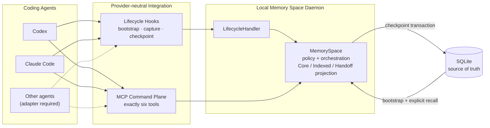

# memory-space

> 面向编码 Agent 的、与 Provider 无关的持久记忆层。
>
> A provider-neutral persistent memory layer for coding agents.

[中文](#readme-zh) · [English](#readme-en)

```text
Codex ─┐
Claude ├─ MCP + Lifecycle → MemorySpace → SQLite
Other ─┘
```

它让项目记忆跨越 Session、进程重启和 Provider，同时控制：哪些内容值得记住、哪些内容可被搜索、哪些内容进入默认上下文，以及哪些状态应交接给下一个 Agent。

It preserves durable project memory across sessions, process restarts, and providers, while controlling what gets remembered, what is searchable, what becomes default context, and what is handed off to the next agent.



> **能力说明 / Capability note:** “Provider-neutral” 指共享的 contract 与 runtime，不表示所有 Agent 都能零配置接入。Codex 已完成真实 lifecycle + MCP 验证；Claude Code 的真实 lifecycle 已通过，但模型主动调用 MCP 仍取决于网关是否保留标准工具名；其他 Agent 需要单独实现 adapter。

---

<a id="readme-zh"></a>

## 中文

> [切换到 English](#readme-en)

### 它解决什么问题

编码 Agent 通常只了解当前对话。换一个 Session、重启进程，或者从 Codex 切换到 Claude Code 后，重要的项目决策、约束、进行中的任务和阻塞信息很容易丢失。直接把完整历史对话塞回上下文，又会带来噪音、成本和安全边界不清的问题。

memory-space 把“聊天记录”与“项目记忆”分开：

- 对话只是证据，Memory 才是经过策略筛选的持久状态；
- `Core` Memory 自动进入默认上下文，但容量和类型受到控制；
- `Indexed` Memory 默认不注入，需要搜索或显式召回；
- `Handoff Snapshot` 保存下一位 Agent 真正需要接手的工作状态；
- 所有 Memory 都归属于一个 `Space`，不会跨项目泄漏。

### 核心能力

| 能力 | 它做什么 |
| --- | --- |
| 跨 Session 持久化 | 新 Session 可以恢复同一 Space 的 Core Memory 和最新 Handoff。 |
| 跨进程恢复 | SQLite 关闭并重新打开后，Space、Session、Memory、Checkpoint 和 Handoff 仍然存在。 |
| 跨 Provider 交接 | Codex 与 Claude Code 共享同一个 MemorySpace、生命周期 contract 和同一组六个 MCP 工具；Lifecycle/Handoff 已验证，Claude 模型主动调用 MCP 仍受当前网关兼容性影响。 |
| 渐进式披露 | 重要的 Core Memory 默认可见，细节保留为 Indexed Memory，按需搜索。 |
| 可控记忆写入 | 显式记忆默认进入 Indexed；提升到 Core 需要经过策略与容量检查。 |
| 确定性 Checkpoint | Memory 更新、Handoff 创建和事件边界推进在一个事务中提交，并支持幂等重试。 |
| 来源与变更历史 | Memory 保留来源 Session/Event、版本、状态变化和提升/降级（promotion/demotion）历史。 |
| 本地优先 | v1 daemon 只监听 loopback，SQLite 是默认且唯一的持久权威数据源（Source of Truth）。 |

### 它如何工作

集成有两条通道：Lifecycle hook 负责自动启动上下文、捕获对话证据和触发 checkpoint；MCP 负责 Agent 主动发起的搜索、记忆、提升和 checkpoint 命令。两条通道最终都进入同一个本地 memory-space daemon 与 `MemorySpace` 实例。

1. 项目通过 `.memory-space/config.json` 绑定到一个 `Space`。
2. Agent 启动 Session 时，Lifecycle hook 解析或复用内部 Session，并注入 Core Memory 与最新 Handoff。
3. 完整用户 prompt 和可靠的最终回复文本被记录为轻量对话事件；完整 transcript 文件不会被默认读取或复制进数据库。
4. Agent 可通过 MCP 显式搜索、记忆或提升 Memory。
5. `PreCompact`、`SessionEnd` 或显式 checkpoint 将新事件提取为候选项；领域与准入策略再决定创建、更新、忽略及 Core/Indexed tier，最后在事务中更新 Memory 与 HandoffSnapshot。
6. 同一 Provider 的 resume 复用原内部 Session；另一个 Provider 会创建自己的 Session，但只要绑定同一 Space，就能通过 Core Memory 和最新 HandoffSnapshot 接手工作。Indexed 细节仍需显式召回。

### 核心模型

| 概念 | 含义 |
| --- | --- |
| `Space` | 项目记忆的隔离边界。一个 Memory 只能属于一个 Space。 |
| `Session` | 某个 Provider 的一次对话身份；恢复后继续绑定原 Space。 |
| `SessionEvent` | 追加式证据，例如用户消息、Agent 回复或结构化 Memory 事件。 |
| `Memory` | 经过领域与准入策略验证的持久项目知识或工作状态，带类型、状态、版本和来源追踪（provenance）。 |
| `Core` | 有界的默认上下文，适合稳定决策、约束、目标和需跨 Session 延续的工作状态。 |
| `Indexed` | 可搜索但不默认注入的细节；显式 remember 默认创建为 Indexed。 |
| `Checkpoint` | 将未提交事件原子地转换为 Memory 更新和 Handoff 的边界。 |
| `HandoffSnapshot` | 每次 checkpoint 生成的不可变交接快照，包含下一位 Agent 需要的目标、已完成事项、活跃任务、决策、阻塞、问题和下一步。它不是新的 Memory tier，也不会覆盖 Core。 |

### 快速开始

要求：Git、Node.js `>= 22.13.0`、pnpm `11.x`。以下命令从仓库根目录运行：

```bash
git clone https://github.com/Aurora-N/memory-space.git
cd memory-space
corepack enable
pnpm install
pnpm run check
pnpm start
```

默认配置不要求 `.env` 文件。daemon 运行在 `http://127.0.0.1:4310`，数据写入启动命令当前目录下的 `./data/memory-space.db`；如需自定义，请参考 `.env.example` 并显式导出对应环境变量。

确认 daemon 已就绪：

```bash
curl --fail --silent http://127.0.0.1:4310/health
# {"status":"ok"}
```

在另一个终端中，把目标项目绑定到一个 Space：

```bash
pnpm memory-space init \
  --cwd /absolute/path/to/project \
  --name "My project"

pnpm memory-space doctor --cwd /absolute/path/to/project
pnpm memory-space status --cwd /absolute/path/to/project
```

`init` 只创建或确认 Space，并原子写入项目绑定；它不会修改全局 Codex 或 Claude 配置。接下来按 Provider 文档配置 hooks 与 MCP：

- [Codex 集成](docs/CODEX_INTEGRATION.md)
- [Claude Code 集成](docs/CLAUDE_CODE_INTEGRATION.md)

最短的跨 Session 验证路径：在已绑定项目中启动 Provider，确认 bootstrap 注入 Memory Space Session handle；让 Agent 通过 MCP 记住一个项目决策并执行 checkpoint；随后启动一个新 Session，确认它能从同一 Space 的 Core/Handoff 或显式搜索中恢复该信息。完整自动化验证命令见下文。

### MCP 工具

所有 Provider 共用且只公开以下六个工具：

| 工具 | 用途 |
| --- | --- |
| `memory_bootstrap` | 加载当前 Session 或项目绑定的 Core Memory 与最新 Handoff；已知 Session 时同时返回内部 handle。 |
| `memory_context` | 根据 query 从当前 Space 的 active Core/Indexed Memory 构建结构化上下文。 |
| `memory_search` | 在当前 Space 中显式召回 Core 或 Indexed Memory。 |
| `memory_remember` | 创建显式持久 Memory；默认是 Indexed。 |
| `memory_promote` | 在策略、所有权和容量检查后将 Memory 提升到 Core。 |
| `memory_checkpoint` | 将当前 Session 尚未提交的事件推进到下一个持久边界。 |

工具参数不允许 Agent 自行指定可信的 `spaceId`、tier、actor 或 checkpoint 边界。项目绑定和 Session 身份由受信任的本地运行时解析。

### Provider 支持

| Provider | 当前状态 |
| --- | --- |
| Codex | Lifecycle、共享 MCP、自动化验证和真实 Codex smoke 已通过并冻结。 |
| Claude Code | Lifecycle、bootstrap、自动化验证和真实 hook smoke 已通过；当前兼容网关会改写 MCP 双下划线工具名，因此真实模型驱动 MCP 仍是外部阻塞项。 |
| 其他 Agent | 可以复用 provider-neutral lifecycle contract 与六工具 MCP；仍需实现并验证对应 adapter。 |

项目不会为某个 Provider 增加专属 MCP alias 或第七个工具来绕过兼容问题。

### 安全与一致性边界

- v1 daemon 未提供远程认证，因此只允许 `127.0.0.1`、`::1` 和 `localhost`；不支持 LAN/公网部署。
- 除 `GET /health` 外，daemon 路由都会验证 localhost Host/Origin；JSON mutation 要求正确的 `Content-Type`。
- `Space` 是同一 daemon 内的逻辑项目隔离，不是多用户认证边界；因此 v1 daemon 只能在受信任的本机使用。
- 一个 daemon 只创建一个 `MemorySpace`/SQLite owner；不要让多个进程同时拥有同一数据库文件。
- Lifecycle 失败采用“失败不阻断”（fail-open），不应阻断 Agent；显式 MCP Memory 命令采用“失败可见”（fail-visible）。
- Bootstrap 会把召回内容标记为不可信项目数据，不能让 Memory 提升为系统级指令。
- `CachePort` 是尽力而为的派生状态（best-effort derived state）；缓存失败不能使 Store 中的正确数据失效。
- Checkpoint 写操作、HandoffSnapshot 和事件边界在同一个 Store 事务中提交。

### 存储与扩展边界

当前 v1 使用 SQLite 作为零配置默认实现。应用层依赖异步端口，而不是直接依赖 SQLite：

- `MemoryStore`：SQLite 是当前实现；PostgreSQL adapter 仅预留接口，尚未交付。
- `CachePort`：默认是 no-op；Redis cache adapter 仅预留接口，且未来也不能成为 Source of Truth。
- `MemoryExtractor`：当前是确定性的 rule-based extractor，可替换，但远程/LLM extractor 不属于 v1。

### 项目状态

- MVP 与领域模型：Frozen。
- Provider Integration P0–P4：产品级自动化范围已完成；Claude 真实模型驱动 MCP 保留明确的外部兼容例外说明（waiver）。
- P5 Productization：Complete / Review Pass。
- P6 Memory Quality v1：Complete / Review Pass / Frozen。
- P6 B4 Semantic Retrieval / Dedup：经过评估后主动延期到 v2，而不是遗漏功能。详见 [ADR 0004](docs/adr/0004-semantic-recall-options-after-b1.md)。

v1 已知仍存在无词面重叠的语义表达不一致（semantic wording mismatch）和无稳定 key 的重复记忆（unkeyed duplicate）；当前证据不足以证明 embedding/vector infrastructure 的收益值得引入其存储、迁移、隐私、离线和模型版本复杂度。后续由真实自用（dogfooding）数据决定是否在 v2 重启。

### 如何验证

```bash
# lint + typecheck + 全量测试 + provider smoke self-tests
pnpm run check

# 为未来 monorepo 执行所有 workspace check
pnpm run check:workspace

# 跨 Session / Provider 产品证明
pnpm memory-space eval cross-session

# 20-Session Memory Quality 评估
pnpm memory-space eval quality
pnpm memory-space eval quality --json

# B3 Core/Handoff before/after gate
pnpm memory-space eval quality --compare-stage-b2-core-handoff
```

真实 Provider smoke 需要本机已安装并完成认证的对应 CLI：

```bash
pnpm run smoke:codex:p2 -- --preflight
pnpm run smoke:codex:p2

pnpm run smoke:claude:p3 -- --preflight
pnpm run smoke:claude:p3 -- --hooks-only
```

### 已知限制

- 未认证的远程/LAN daemon 不在 v1 支持范围内。
- SQLite 采用单 active owner 假设；PostgreSQL adapter 尚未实现。
- 当前 extractor 和 retrieval 是保守、确定性的规则/词面策略，不提供通用语义理解。
- semantic retrieval、vector database 和 semantic consolidation 已延期到 v2。
- Claude Code 在特定兼容网关下的真实 MCP tool call 仍受工具名改写问题阻塞。
- 完整 transcript ingestion、provider event 通用幂等和多进程 SQLite ownership 尚未实现。

### 文档入口

- [产品规格](docs/PRODUCT_SPEC.md)
- [领域模型](docs/DOMAIN_MODEL.md)
- [HTTP / daemon API](docs/API.md)
- [Provider Integration Guardrails](docs/PROVIDER_INTEGRATION_GUARDRAILS.md)
- [Codex 集成](docs/CODEX_INTEGRATION.md)
- [Claude Code 集成](docs/CLAUDE_CODE_INTEGRATION.md)
- [v1 Roadmap](docs/V1_ROADMAP.md)
- [P6 Memory Quality v1](docs/MEMORY_QUALITY_V1_SPEC.md)
- [P6 B3 结果](docs/quality/P6_STAGE_B3_RESULT.md)
- [ADR 0004：Semantic Memory 延期到 v2](docs/adr/0004-semantic-recall-options-after-b1.md)

---

<a id="readme-en"></a>

## English

> [切换到中文](#readme-zh)

### What problem does it solve?

Coding agents usually understand only the current conversation. Important decisions, constraints, active work, and blockers are easily lost when a session ends, a process restarts, or work moves from Codex to Claude Code. Re-injecting a full transcript is noisy, expensive, and difficult to govern.

memory-space separates conversation evidence from durable project memory:

- conversation events are evidence; validated `Memory` is durable state;
- bounded `Core` Memory becomes default context;
- `Indexed` Memory stays searchable without automatic injection;
- a `HandoffSnapshot` carries only the working state the next agent needs;
- every Memory belongs to one isolated `Space`.

### Core capabilities

| Capability | What it provides |
| --- | --- |
| Cross-session persistence | A new Session restores Core Memory and the latest Handoff from the same Space. |
| Process recovery | Space, Session, Memory, Checkpoint, and Handoff survive a SQLite close/reopen. |
| Cross-provider handoff | Codex and Claude Code share one MemorySpace, lifecycle contract, and six-tool MCP surface. Lifecycle/Handoff is verified; direct Claude model-driven MCP remains gateway-dependent. |
| Progressive disclosure | Core Memory is visible by default; Indexed detail is recalled explicitly. |
| Governed writes | Explicit Memory starts Indexed; Core promotion is policy- and capacity-checked. |
| Deterministic checkpoints | Memory updates, Handoff creation, and event-boundary advancement commit transactionally and retry safely. |
| Provenance and history | Memory retains source Session/Event information, versions, status changes, and tier-transition history. |
| Local-first runtime | The v1 daemon is loopback-only and SQLite is the default and only durable source of truth. |

### How it works

The integration has two channels. Lifecycle hooks automatically bootstrap context, capture conversation evidence, and trigger checkpoints. MCP carries agent-initiated search, remember, promote, and checkpoint commands. Both channels enter the same local memory-space daemon and `MemorySpace` instance.

1. A project binds to a `Space` through `.memory-space/config.json`.
2. On Session start, a lifecycle hook resolves or reuses the internal Session and injects Core Memory plus the latest Handoff.
3. Full user prompts and reliable final-response text are captured as lightweight conversation events; transcript files are not read or copied by default.
4. The agent can explicitly search, remember, or promote Memory through MCP.
5. `PreCompact`, `SessionEnd`, or an explicit checkpoint extracts candidates. Domain and admission policy then decide create/update/ignore behavior and the Core/Indexed tier before Memory and HandoffSnapshot are updated transactionally.
6. A resume from the same provider reuses its internal Session. Another provider creates its own Session, but if it binds to the same Space it can continue through Core Memory and the latest HandoffSnapshot. Indexed detail remains explicit recall.

### Memory model

| Concept | Meaning |
| --- | --- |
| `Space` | Project-level logical isolation boundary. A Memory belongs to exactly one Space. |
| `Session` | A durable provider conversation identity bound to one Space. |
| `SessionEvent` | Append-oriented evidence such as a prompt, response, or structured Memory event. |
| `Memory` | Durable knowledge or working state validated by domain/admission policy, with type, status, version, and provenance. |
| `Core` | Type- and capacity-bounded default context for stable decisions, constraints, goals, and continuation state. |
| `Indexed` | Searchable detail that is not injected by default. Explicit remember starts here. |
| `Checkpoint` | Atomic boundary that turns uncommitted events into Memory changes and a Handoff. |
| `HandoffSnapshot` | Immutable checkpoint output containing goal, completed work, active tasks, decisions, blockers, questions, and next steps. It is not a Memory tier and does not overwrite Core. |

### Quick start

Requirements: Git, Node.js `>= 22.13.0`, and pnpm `11.x`. Run these commands from the repository root:

```bash
git clone https://github.com/Aurora-N/memory-space.git
cd memory-space
corepack enable
pnpm install
pnpm run check
pnpm start
```

The defaults require no `.env` file. The daemon listens at `http://127.0.0.1:4310` and stores data in `./data/memory-space.db` relative to the directory where `pnpm start` runs. To customize it, use `.env.example` as a reference and explicitly export the variables.

Confirm that the daemon is ready:

```bash
curl --fail --silent http://127.0.0.1:4310/health
# {"status":"ok"}
```

In another terminal, bind and inspect the target project:

```bash
pnpm memory-space init \
  --cwd /absolute/path/to/project \
  --name "My project"

pnpm memory-space doctor --cwd /absolute/path/to/project
pnpm memory-space status --cwd /absolute/path/to/project
```

`init` creates or confirms the Space and atomically writes the project binding. It does not edit global Codex or Claude configuration. Continue with the [Codex guide](docs/CODEX_INTEGRATION.md) or [Claude Code guide](docs/CLAUDE_CODE_INTEGRATION.md).

For a minimal cross-session exercise, start the configured provider in the bound project and confirm bootstrap injected a Memory Space Session handle. Ask the agent to remember one project decision through MCP and checkpoint it. Start a new Session, then confirm the decision returns through Core/Handoff or explicit search. The automated validation commands are below.

### MCP tools

Every provider shares exactly six tools:

| Tool | Purpose |
| --- | --- |
| `memory_bootstrap` | Load Core Memory and the latest Handoff for the current Session or project binding; return the internal handle when a Session is known. |
| `memory_context` | Build query-relevant structured context from active Core/Indexed Memory in the current Space. |
| `memory_search` | Explicitly recall Core or Indexed Memory from the current Space. |
| `memory_remember` | Create explicit durable Memory, defaulting to Indexed. |
| `memory_promote` | Promote Memory to Core after ownership, policy, and capacity checks. |
| `memory_checkpoint` | Advance uncommitted Session events to the next durable boundary. |

Tool callers cannot supply trusted Space, tier, actor, or checkpoint-boundary controls. Those values come from the trusted local runtime and Session binding.

### Provider support

| Provider | Current status |
| --- | --- |
| Codex | Lifecycle, shared MCP, automated validation, and real Codex smoke have passed; P2 is frozen. |
| Claude Code | Lifecycle/bootstrap, automated validation, and real hook smoke pass. Real model-driven MCP remains blocked by the active compatibility gateway rewriting double-underscore MCP tool names. |
| Other agents | May reuse the provider-neutral lifecycle contract and six-tool MCP plane, but require their own implemented and validated adapter. |

The project does not add provider-specific MCP aliases or a seventh tool to work around client compatibility issues.

### Safety and consistency boundaries

- The unauthenticated v1 daemon accepts only `127.0.0.1`, `::1`, and `localhost`; LAN/remote deployment is unsupported.
- All daemon routes except `GET /health` validate localhost Host/Origin, and JSON mutations require the correct media type.
- A `Space` is logical project isolation inside one daemon, not a multi-user authentication boundary. Use v1 only on a trusted local machine.
- One daemon provides the single `MemorySpace`/SQLite owner; do not run multiple owners against the same database.
- Lifecycle failures are fail-open for the coding agent; explicit MCP Memory commands remain fail-visible.
- Bootstrap labels recalled Memory as untrusted project data, never as higher-priority instructions.
- `CachePort` is best-effort derived state. Cache failure cannot invalidate correct Store data.
- Checkpoint mutations, Handoff creation, and the event boundary commit in one Store transaction.

### Storage and extension boundaries

SQLite is the zero-configuration v1 implementation. The application depends on asynchronous ports rather than SQLite directly:

- `MemoryStore`: SQLite is implemented; a PostgreSQL adapter interface is reserved but not shipped.
- `CachePort`: no-op by default; a Redis cache adapter interface is reserved and must never become the source of truth.
- `MemoryExtractor`: deterministic rule-based implementation in v1; remote/LLM extraction is outside v1 scope.

### Project status

- MVP and domain model: Frozen.
- Provider Integration P0–P4: complete at the reviewed product/automation scope, with an explicit external compatibility waiver for real Claude model-driven MCP.
- P5 Productization: Complete / Review Pass.
- P6 Memory Quality v1: Complete / Review Pass / Frozen.
- P6 B4 Semantic Retrieval / Dedup: deliberately deferred to v2. See [ADR 0004](docs/adr/0004-semantic-recall-options-after-b1.md).

Known v1 limitations include semantic wording mismatches with no lexical overlap and unkeyed duplicates. Current evidence does not show that embedding/vector infrastructure is worth its storage, migration, privacy, offline, and model-version complexity. Real dogfooding data should drive any v2 reopening.

### Validation

```bash
pnpm run check
pnpm run check:workspace
pnpm memory-space eval cross-session
pnpm memory-space eval quality
pnpm memory-space eval quality --json
pnpm memory-space eval quality --compare-stage-b2-core-handoff
```

Real-provider runners additionally require an installed and authenticated provider CLI:

```bash
pnpm run smoke:codex:p2 -- --preflight
pnpm run smoke:codex:p2

pnpm run smoke:claude:p3 -- --preflight
pnpm run smoke:claude:p3 -- --hooks-only
```

### Known limitations

- Unauthenticated LAN/remote daemon deployment is outside v1 scope.
- SQLite assumes one active owner; the PostgreSQL adapter is not implemented.
- Extraction and retrieval are conservative deterministic rule/lexical policies, not general semantic understanding.
- Semantic retrieval, vector infrastructure, and semantic consolidation are deferred to v2.
- Real Claude Code MCP tool calls remain blocked under gateways that rewrite MCP tool names.
- Full transcript ingestion, generic provider-event idempotency, and multi-process SQLite ownership are not implemented.

### Documentation

- [Product spec](docs/PRODUCT_SPEC.md)
- [Domain model](docs/DOMAIN_MODEL.md)
- [HTTP / daemon API](docs/API.md)
- [Provider Integration Guardrails](docs/PROVIDER_INTEGRATION_GUARDRAILS.md)
- [Codex integration](docs/CODEX_INTEGRATION.md)
- [Claude Code integration](docs/CLAUDE_CODE_INTEGRATION.md)
- [v1 roadmap](docs/V1_ROADMAP.md)
- [P6 Memory Quality v1](docs/MEMORY_QUALITY_V1_SPEC.md)
- [P6 B3 result](docs/quality/P6_STAGE_B3_RESULT.md)
- [ADR 0004: defer semantic memory to v2](docs/adr/0004-semantic-recall-options-after-b1.md)
